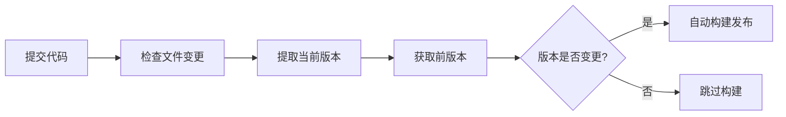
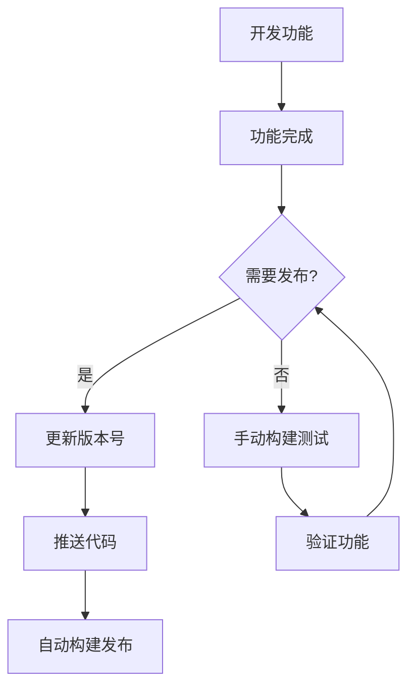

# CI/CD 构建方式对比

## 🤖 自动构建 vs 🛠️ 手动构建

### 📊 **对比表**

| **特性** | **自动构建**<br/>`docker-build-auto.yml` | **手动构建**<br/>`docker-build-manual.yml` |
|---------|-----------------------------------|-----------------------------------|
| **触发方式** | 推送代码到 `main` 分支 | GitHub Actions 手动触发 |
| **触发条件** | 文件变更 + 版本号变更 | 用户手动执行 |
| **版本来源** | `frontend/package.json` | 用户输入或自动读取 |
| **构建频率** | 自动（版本变更时） | 按需手动执行 |
| **适用场景** | 正式发布、版本管理 | 测试构建、临时版本 |

---

## 🤖 **自动构建详解**

### **版本检测逻辑**


### **触发条件**
- **文件路径触发**：
  ```yaml
  paths:
    - 'frontend/package.json'    # 版本文件
    - 'frontend/src/**'          # 前端源码
    - 'web_app.py'              # 后端核心文件
    - 'storage.py'              # 存储模块
    - 'scheduler.py'            # 调度器
    - 'notify.py'               # 通知模块
    - 'utils.py'                # 工具函数
  ```

- **版本比较逻辑**：
  ```bash
  # 当前版本
  CURRENT_VERSION=$(jq -r '.version' frontend/package.json)
  
  # 前一个提交的版本
  if git show HEAD~1:frontend/package.json >/dev/null 2>&1; then
    PREVIOUS_VERSION=$(git show HEAD~1:frontend/package.json | jq -r '.version')
  else
    PREVIOUS_VERSION="0.0.0"  # 首次构建
  fi
  
  # 版本变更检测
  if [ "$PREVIOUS_VERSION" != "$CURRENT_VERSION" ]; then
    should_build=true  # 触发构建
  fi
  ```

### **使用场景**
- ✅ **正式版本发布** - 版本号管理规范
- ✅ **持续集成** - 代码提交自动构建
- ✅ **生产环境部署** - 可追溯的版本历史

### **操作流程**
```bash
# 1. 更新版本号
cd frontend
npm run version:patch    # 1.1.3 → 1.1.4

# 2. 推送到远程仓库
git push && git push --tags

# 3. 自动触发构建
# ✅ 检测版本变更
# ✅ 构建 Docker 镜像
# ✅ 推送到 Docker Hub
# ✅ 创建 GitHub Release
```

---

## 🛠️ **手动构建详解**

### **输入参数**
- **version** (可选)：自定义版本号，留空则自动读取 `package.json`
- **push_to_registry** (必选)：是否推送到 Docker Hub
- **update_latest** (必选)：是否同时更新 `latest` 标签

### **版本确定逻辑**
```bash
# 智能版本选择
if [ -n "${{ inputs.version }}" ]; then
  VERSION="${{ inputs.version }}"          # 使用用户输入
else
  VERSION="v$(jq -r '.version' frontend/package.json)"  # 自动读取
fi
```

### **使用场景**
- ✅ **测试构建** - 快速验证构建过程
- ✅ **临时版本** - 不影响版本历史
- ✅ **热修复发布** - 紧急问题快速修复
- ✅ **预发布测试** - 在正式发布前验证

### **操作流程**
1. 进入 GitHub 项目页面
2. 点击 **Actions** 标签
3. 选择 **Manual Docker Build and Push**
4. 点击 **Run workflow**
5. 填写参数（或使用默认值）
6. 点击 **Run workflow** 执行

---

## 🎯 **最佳实践**

### **推荐工作流程**



### **使用建议**

#### **自动构建 - 用于**
- 🎯 **正式发布**：版本号递增，创建正式 Release
- 📦 **生产部署**：可追溯的版本管理
- 🔄 **持续集成**：代码变更自动验证

#### **手动构建 - 用于**  
- 🧪 **开发测试**：验证构建流程，不影响版本历史
- 🚨 **紧急修复**：快速发布热修复版本
- 🎭 **实验性功能**：测试新功能，不创建正式版本

### **版本管理规范**

#### **语义化版本 (Semantic Versioning)**
- **主版本 (Major)**：`2.0.0` - 破坏性变更
- **次版本 (Minor)**：`1.2.0` - 新功能，向后兼容  
- **补丁版本 (Patch)**：`1.1.4` - Bug 修复，向后兼容

#### **版本更新命令**
```bash
cd frontend

# 补丁版本：Bug 修复
npm run version:patch

# 次版本：新功能
npm run version:minor

# 主版本：破坏性变更
npm run version:major
```

---

## 📋 **故障排除**

### **常见问题**

#### **自动构建未触发**
- ✅ 检查 `frontend/package.json` 版本号是否变更
- ✅ 确认推送的分支是 `main` 或 `master`  
- ✅ 查看 **Actions** 页面的构建日志

#### **手动构建失败**
- ✅ 检查 **Secrets** 中的 Docker Hub 凭据
- ✅ 确认版本号格式正确（如：`v1.1.3`）
- ✅ 查看构建日志中的错误信息

#### **版本号检测问题**
- ✅ 确保 `frontend/package.json` 文件存在
- ✅ 检查 JSON 格式是否正确
- ✅ 版本号应符合语义化版本规范

---

## 🎉 **总结**

- **自动构建** = 规范化的版本发布流程
- **手动构建** = 灵活的测试和紧急发布工具
- **两者结合** = 完善的 CI/CD 体系

选择合适的构建方式，让开发和发布更加高效！🚀
